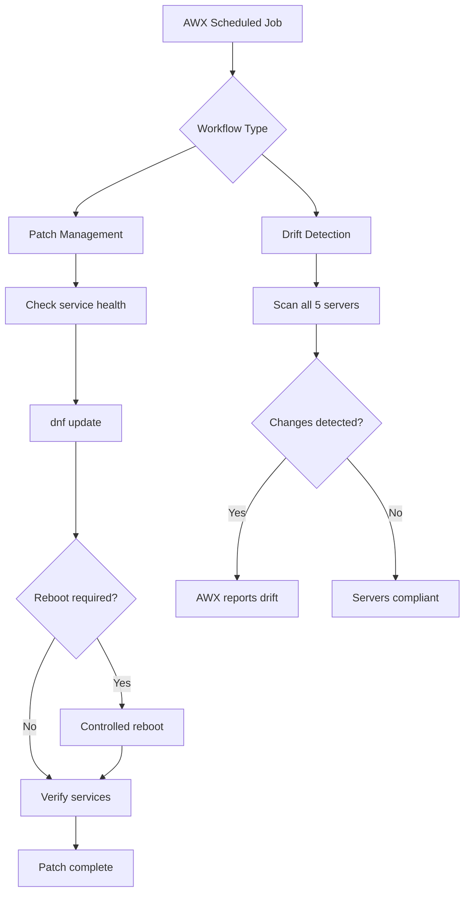

# Patch Management + Drift Detection

Automated patch management and configuration drift detection across a
Rocky Linux lab environment.

---

## Architecture

---

## Technologies

| Technology       | Purpose                              |
| ---------------- | ------------------------------------ |
| Ansible          | Patch automation and drift detection |
| AWX              | Scheduling and orchestration         |
| dnf              | Package management                   |
| needs-restarting | Reboot requirement detection         |
| Rocky Linux 9    | Target servers                       |

---

## Patch Targets

Production servers are excluded from automated patching.

| Host         | Environment | Patched          |
| ------------ | ----------- | ---------------- |
| dev-web-01   | Development | Yes              |
| stage-web-01 | Staging     | Yes              |
| prod-web-01  | Production  | No - manual only |

---

## Drift Detection

Scans all 5 servers daily for configuration drift:

| Check | Expected State |
| ----- | -------------- |
| node_exporter binary | Present |
| node_exporter service | active (running) |
| SSH PermitRootLogin | no |
| SSH PasswordAuthentication | no |
| auditd service | active (running) |

---

## AWX Schedule

- Job: Drift Detection
- Schedule: Daily at 02:00 AM
- Targets: All 5 lab servers

---

## DevOps Skills Demonstrated

- Automated patch management with safety checks
- Rolling update strategy (serial: 1)
- Maintenance window enforcement
- Pre-flight and post-flight service verification
- Conditional reboot logic
- Structured patch reporting with human-readable output
- Configuration drift detection across 5 servers
- AWX job scheduling for automated compliance
- Environment-aware automation (dev/stage vs prod)
- SRE reliability engineering practices

---

## Part of DevOps Portfolio

- [Project 1 - Enterprise Infrastructure Automation Lab](https://github.com/proclaudio/enterprise-infrastructure-automation-lab)
- [Project 2 - CI/CD Push-to-Deploy Pipeline](https://github.com/proclaudio/cicd-push-to-deploy-pipeline)
- [Project 3 - Infrastructure Monitoring Stack](https://github.com/proclaudio/infrastructure-monitoring-stack)
- [Project 4 - Automated Security Hardening](https://github.com/proclaudio/automated-security-hardening)
- [Project 5 - Centralized Log Management](https://github.com/proclaudio/centralized-log-management)
- **Project 6 - Patch Management + Drift Detection** (this repo)
- Project 7 - AWX RBAC + Team Management (coming soon)
- Project 8 - Kubernetes Platform Lab (coming soon)
